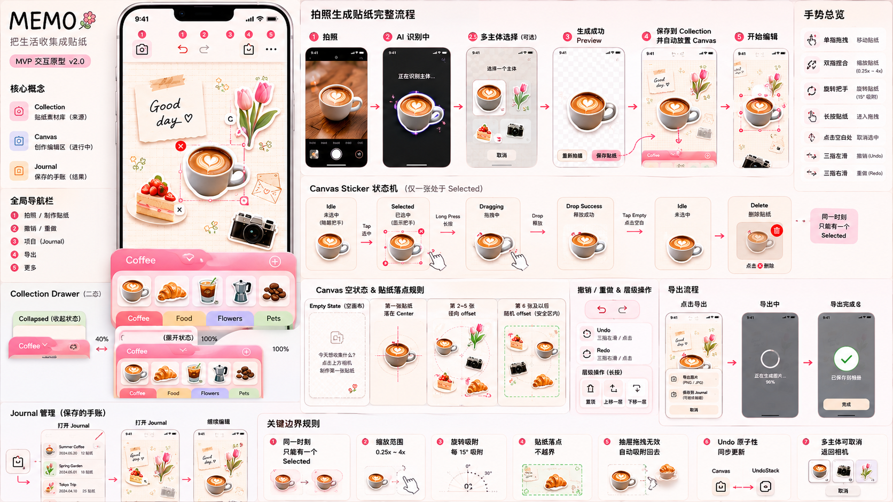

# MEMO · 贴纸手账

> 把生活收集成贴纸，拼贴成记忆。

MEMO 是一款 HarmonyOS 原生应用，通过拍照将现实世界中的物体自动抠图生成贴纸，在纸张画布中自由组合创作，形成属于自己的视觉手账。

不是生产力工具。不是照片编辑器。不是 Canva。  
它应该像一本实体贴纸手账、一个日本文具店的精品收纳册。

## 产品截图



## 核心功能

| 功能 | 描述 |
|------|------|
| 📷 拍照/相册导入 | 一键拍照或从相册选择图片 |
| ✂️ 智能抠图 | 基于 VisionKit 自动识别主体并抠图 |
| 🏷️ 贴纸收藏 | 白边照片贴纸，按 Collection（咖啡/美食/花草/宠物）分类收藏 |
| 🖼️ 纸张画布 | 在带纹理的纸张画布上拖拽、缩放、旋转贴纸 |
| 📓 手账记录 | 保存画布快照到手账，随时回顾 |

## 设计体系 · Paper Craft UI

MEMO 采用 **Paper Craft UI** 设计系统 —— 整个界面由层叠的实体纸张构成，而非标准 App 卡片。

- **Warm Paper Palette**: `#FAF8F4` 背景、`#F5EFE8` 画布、`#F3D6D8` / `#F4E7D5` / `#E4E0F3` / `#DDE7D8` 文件夹色
- **Visible Paper Thickness**: 每个面板和文件夹标签都有可见的纸张厚度（多层 Stack 叠加：厚度层 + 双层 shadow + 主色层 + 顶部高光边）
- **Paper Grain Texture**: 画布背景使用 45°+135° 交叉 linearGradient 模拟纸张纤维纹理
- **Soft Realistic Shadows**: 两层 shadow 叠加（核心贴底 shadow + 环境柔化 shadow）
- **Tactile Stickers**: 12px 白色边框 + 24px 圆角 + `0 6 20 rgba(0,0,0,0.08)` 阴影

Keywords: Soft, Paper, Collectible, Warm, Tactile, Feminine, Premium, Minimal, Calm

## 技术栈

- **平台**: HarmonyOS 6.1.0+ (API 23)
- **语言**: ArkTS (Strict Mode)
- **UI 框架**: ArkUI
- **设计体系**: Paper Craft UI（自定义纸张材质系统）
- **AI 能力**: `@kit.VisionKit` — 主体分割
- **相机**: `@kit.CameraKit` — 拍照选取
- **相册**: `@kit.MediaLibraryKit` — 相册读写
- **数据存储**: RDB (`relationalStore`) + Preferences

## 项目结构

```
entry/src/main/ets/
├── entryability/           # 入口 Ability
├── entrybackupability/     # 备份恢复 Ability
├── pages/                  # 页面
│   ├── Index.ets           # 根页面 (Navigation 容器)
│   ├── home/               # 拍照/处理/预览流程
│   │   ├── ProcessingPage.ets      # AI 抠图处理中
│   │   ├── StickerPreviewPage.ets  # 抠图结果预览 + 签名动画
│   │   ├── NoSubjectPage.ets       # 未检测到主体
│   │   ├── BlurSubjectPage.ets     # 主体模糊
│   │   ├── MultiSubjectSelectPage.ets # 多主体选择
│   │   └── ...                     # 其他旧页面（待清理）
│   ├── canvas/             # 画布创作模块（唯一主界面）
│   │   ├── CanvasEditPage.ets      # 主编辑器：Canvas + CollectionDrawer
│   │   ├── ExportPage.ets          # 导出分享
│   │   └── BackgroundPage.ets      # 背景选择
│   └── journal/            # 手账模块
│       ├── JournalPage.ets         # 手账列表
│       └── JournalDetailPage.ets   # 手账详情
├── components/             # 可复用组件
│   ├── canvas/             # 画布核心组件
│   │   ├── CanvasElement.ets       # 画布贴纸（白边+圆角+阴影+选中态）
│   │   ├── CollectionDrawer.ets    # Collection 抽屉（层叠文件夹标签）
│   │   ├── PaperSheet.ets          # 厚纸板装饰组件（纸张厚度+shadow+高光）
│   │   ├── CanvasToolPanel.ets     # 画布工具面板
│   │   ├── StickerPickerSheet.ets  # 贴纸选择面板
│   │   ├── StickerEditSheet.ets    # 贴纸编辑面板
│   │   ├── TextToolSheet.ets       # 文字工具面板
│   │   ├── FilterToolSheet.ets     # 滤镜工具面板
│   │   ├── AdjustToolSheet.ets     # 调整工具面板
│   │   ├── BackgroundToolSheet.ets # 背景工具面板
│   │   └── LayerToolSheet.ets      # 图层工具面板
│   ├── hds/                # HDS 风格封装组件
│   │   ├── HdsActionBar.ets
│   │   ├── HdsSnackBar.ets
│   │   ├── HdsToolBar.ets
│   │   └── HdsListItem.ets
│   └── ...                 # 其他旧组件（待清理）
├── models/                 # 数据模型
│   ├── Sticker.ets
│   ├── Collection.ets
│   ├── CanvasSticker.ets
│   ├── Journal.ets
│   └── ...
├── database/               # 数据库
│   └── RdbHelper.ets
├── utils/                  # 工具类
│   ├── ImageProcessor.ets
│   ├── CanvasExporter.ets
│   ├── PermissionManager.ets
│   └── ColorUtils.ets      # 颜色处理（hex变暗等）
└── constants/              # 主题常量
    └── ThemeConstants.ets
```

## 当前页面清单

### 活跃页面（Paper Craft UI 已适配）

| 页面 | 路径 | 状态 |
|------|------|------|
| 根页面（Navigation） | `pages/Index.ets` | ✅ 已适配 |
| 主编辑器 | `pages/canvas/CanvasEditPage.ets` | ✅ Paper Craft |
| AI 处理中 | `pages/home/ProcessingPage.ets` | ⚠️ 待改造 |
| 贴纸预览+签名动画 | `pages/home/StickerPreviewPage.ets` | ✅ 签名动画 |
| 手账列表 | `pages/journal/JournalPage.ets` | ⚠️ 待改造 |
| 手账详情 | `pages/journal/JournalDetailPage.ets` | ⚠️ 待改造 |

### 遗留页面（旧架构，待清理/改造）

| 页面 | 路径 | 状态 |
|------|------|------|
| 首页（旧贴纸库） | `pages/home/HomePage.ets` | ❌ 旧 Tab 架构 |
| 分类管理 | `pages/home/CategoryManagePage.ets` | ❌ 旧架构 |
| 搜索 | `pages/home/SearchPage.ets` | ❌ 旧架构 |
| 设置 | `pages/home/SettingsPage.ets` | ❌ 旧架构 |
| 贴纸编辑 | `pages/home/StickerEditPage.ets` | ❌ 旧架构 |
| 贴纸详情 | `pages/home/StickerDetailPage.ets` | ❌ 旧架构 |
| 保存成功 | `pages/home/SaveSuccessPage.ets` | ❌ 旧架构 |
| 画布背景（旧） | `pages/home/BackgroundPage.ets` | ❌ 旧架构 |
| 未检测到主体 | `pages/home/NoSubjectPage.ets` | ⚠️ 需适配风格 |
| 主体模糊 | `pages/home/BlurSubjectPage.ets` | ⚠️ 需适配风格 |
| 多主体选择 | `pages/home/MultiSubjectSelectPage.ets` | ⚠️ 需适配风格 |
| 隐私政策 | `pages/home/PrivacyPolicyPage.ets` | ⚠️ 需适配风格 |
| 用户协议 | `pages/home/UserAgreementPage.ets` | ⚠️ 需适配风格 |

## 签名交互 · Sticker Creation Animation

点击"保存贴纸"后播放 900ms 物理贴纸诞生动画：

1. **白边生长**（200ms）：白色边框从 0 渐长为 12px
2. **轻微抬起**（150ms）：scale 1.0 → 1.05，shadow 加深
3. **浮起**（200ms）：贴纸向上浮动 30px
4. **飞向 Collection**（250ms）：缩小并飞向屏幕底部 Collection 区域，淡出
5. **Soft-land**（100ms）：副本 soft-land 到 Canvas 中心

## 启动方式

使用 DevEco Studio 打开项目，点击运行按钮部署到 HarmonyOS 模拟器或真机。

```bash
# 构建命令
hvigorw.bat assembleHap --no-daemon
```

## 相关文档

- [产品规格说明书](spec.md) — 完整的产品功能规格（旧版）
- [开发 Skill](SKILL.md) — HarmonyOS API 23 + Paper Craft UI 开发最佳实践
